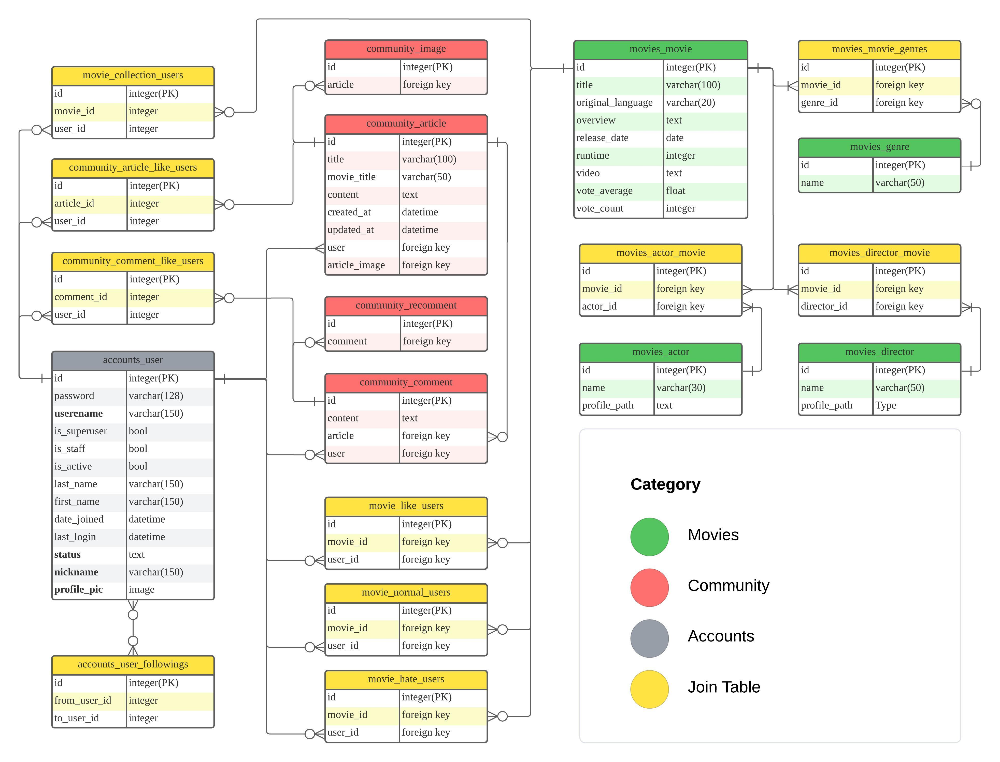

# Movie Nomad
- 영화를 좋아하는 사람들을 위한 영화 추천 및 커뮤니티 서비스

# 프로젝트 목표
- 영화 데이터 기반 추천 서비스 구성
- 영화 추천 알고리즘 구성
- 커뮤니티 서비스 구성
- 서비스 관리 및 유지보수

# 개발환경
- Python 3.9.x
- Django 4.2.x
- Node.js LTS
- Vue.js 3.x

# 사용 API
- TMDB
- Spotify
- kofic(영화진흥위원회)

# Team M.A.D(Making A Difference)
pass

# 목표 서비스 구현 및 실제 구현 정도

# 데이터베이스 모델링 (ERD)

# 영화 추천 알고리즘에 대한 기술적 설명

# 서비스 대표 기능에 대한 설명

# 배포 서버 URL

# 후기

# 개발 노트
### 2023/11/16
- ERD 모델 구축

    

- 컴포넌트 구조 설계

### 2023/11/17

### 2023/11/18