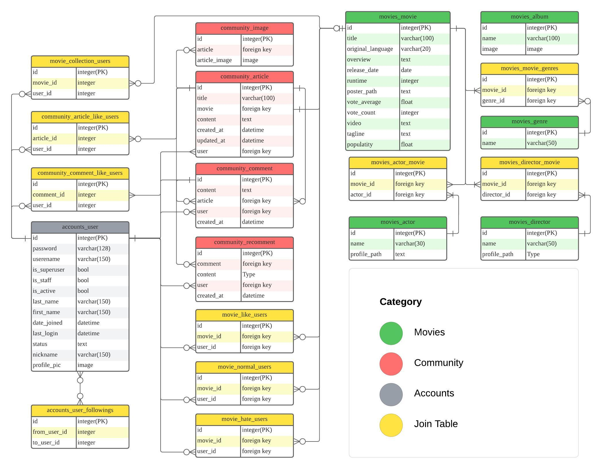

# Movie Nomad[영화 정보 및 커뮤니티 웹 서비스]
- 온라인에 접속할 디바이스만 있다면 언제 어디서든 이용할 수 있는 웹 서비스입니다. 저희는 수 만개의 영화 데이터를 바탕으로 영화를 추천해드리거나, 원하는 영화 정보를 찾을 수 있도록 도와드립니다. 인상 깊게 본 영화가 있으시다면 계정을 만들고 다른 이용자들과 소통해보세요!

## 목차
- [Movie Nomad\[영화 정보 및 커뮤니티 웹 서비스\]](#movie-nomad영화-정보-및-커뮤니티-웹-서비스)
  - [목차](#목차)
  - [개요](#개요)
  - [개발환경](#개발환경)
  - [API](#api)
  - [데이터베이스 모델링 (ERD)](#데이터베이스-모델링-erd)
  - [서비스 차별점](#서비스-차별점)
  - [페이지별 안내(추가적으로 로그인 회원가입 등도 넣을까 고민중)](#페이지별-안내추가적으로-로그인-회원가입-등도-넣을까-고민중)
  - [문제 및 해결(기술적인 어필을 하기 위한 항목)](#문제-및-해결기술적인-어필을-하기-위한-항목)
  - [실패 및 분석(어떤 고민을 했고, 발전가능성을 보여주기 위한 항목)](#실패-및-분석어떤-고민을-했고-발전가능성을-보여주기-위한-항목)
  - [Team M.A.D(Making A Difference)](#team-madmaking-a-difference)

## 개요
- 영화 데이터 기반 추천 서비스 구성
- 커뮤니티 서비스 구성
- 개인 블로그 서비스 제공
- 비동기 통신을 활용한 스크립트 기능
- AJAX 통신과 JSON 구조를 통한 서버 운영
- Bootstrap을 활용한 웹 사이트 디자인
- 클라이언트 및 서버 배포

## 개발환경

## API
- 영화 정보 제공: TMDB API
- 영화 OST 정보 제공: Spotify API

## 데이터베이스 모델링 (ERD)

## 서비스 차별점
- 시력에 불편함을 겪는 분들을 위한 다크모드 기능을 넣고 배리어프리 영화에 대한 정보 제공
- 영화를 통해 언어를 학습하고자 하는 학생들을 위한 다국어모드 및 원어별 영화 필터링 기능
- 영화 전체 제목이 정확히 기억나지 않아도 검색이 가능한 자동완성 기능
- 프로필 페이지를 블로그 형식으로 구성, 일부 내용(프로필 사진, 상태명 등)을 제외하고 자동으로 꾸며지도록 설정
- 해당 영화와 관련된 OST를 확인하고 관련 링크로 연결

## 페이지별 안내(추가적으로 로그인 회원가입 등도 넣을까 고민중)
1. 검색
    - 검색 결과 미리보기 기능을 제공하여 영화를 검색하기 전에 오타 확인 또는 상세 영화페이지로 이동하는 링크를 이용해 사용자의 편의성을 높였습니다.

    

2. 필터
    - 영화목록 페이지에서 다양한 분류 방법을 클릭 한번으로 손쉽게 확인할 수 있도록 구현하였습니다.

    

3. 컬렉션
    - 각각의 이용자들이 추천 또는 좋아하는 영화 컬렉션을 생성하고 공유할 수 있도록 구현하였습니다.  

    

4. OST 정보 제공
    - Spotify API를 이용하여 영화 상세정보 페이지에서 영화 OST정보를 확인할 수 있는 기능을 구현하였습니다.

    

5. 다국어 모드(beta)
    - 한국어, 영어를 동시지원하는 기능을 추가하여 영화를 좋아하는 사람이라면 누구나 접근할 수 있도록 구현하였습니다.

    

6. 다크모드 제공
    - 사이트의 전체적인 톤을 어둡게 전환하는 기능을 제공하여 어두운 곳 또는 취향에 맞는 선택을 할 수 있도록 기능을 구현하였습니다.

    

7.  반응형 UI 제공
    - 다양한 기기를 통하여 서비스를 이용할 수 있도록 UI 구조를 신경써서 제작하였습니다.

    

8. 개인 블로그 서비스 제공
    - 좋아요와 컬렉션 기능 등을 이용하여 자신의 블로그가 자동으로 꾸며질 수 있도록 만들었습니다. 블로그에는 영화를 본 총 시간이나 내가 쓴 게시글 등이 자동 업데이트 되고, 상태 메세지나 프로필 사진은 이용자가 변경 가능합니다.

    

## 문제 및 해결(기술적인 어필을 하기 위한 항목)
- 카테고리 별 영화 분류 및 목록 노출: Django 서버에 API 요청하여 모든 목록을 받아와 pinia store에 저장한 후 filter, find, sort 함수를 활용하여 카테고리 별 영화 목록 배열 구성 및 노출
- 영화 컬렉션: 컬렉션 table 및 중간테이블 생성, ManyToManyField를 통해 컬렉션 내의 영화 데이터 관리
- 컬렉션 내 영화 일치하는 이용자 간에 영화를 추천할 수 있는 기능
- 다크모드 컬러 설정...

## 실패 및 분석(어떤 고민을 했고, 발전가능성을 보여주기 위한 항목)
- 다국어 모드 전체 페이지 적용 실패...
- 

## Team M.A.D(Making A Difference)
|Leader|Member|
|:---:|:---:|
|||
|김지용|장동재|
|BE(serializer/view), FE(UI/기능구현)|BE(view/url/api), FE(기능구현)|