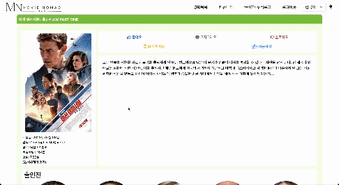

# Movie Nomad
- 언제 어디서나 영화를 추천받거나 영화에 대한 소통을 할 수 있는 영화 추천 및 커뮤니티 웹 서비스

# 프로젝트 목표
- 영화 데이터 기반 추천 서비스 구성
- 영화 추천 알고리즘 구성
- 커뮤니티 서비스 구성
- 개인 홈페이지 서비스 구성
- 서비스 관리 및 유지보수
- 클라이언트 및 서버 배포

# 개발환경

# 사용 API
- 영화 정보 제공: TMDB API
- 영화 OST 정보 제공: Spotify API

# Team M.A.D(Making A Difference)
|Leader|Member|
|:---:|:---:|
|||
|김지용|장동재|
|BE(serializer/view), FE(UI/기능구현)|BE(view/url/api), FE(기능구현)|

# 서비스 목표 타겟
1. 시력에 불편함을 겪는 분
2. 영화를 통해 언어 학습을 하려는 학생
3. 다양한 영화를 추천 받고 싶은 사용자

# 목표 서비스 구현 및 실제 구현 정도
- 1번 타겟을 위한 다크모드 기능 및 배리어프리 영화 정보 제공(완료)
- 2번 타겟을 위한 원어별 영화 필터링 및 다국어 모드(다국어모드 Beta)
- 3번 타겟을 위한 게시판 기능 및 방대한 영화 데이터베이스(완료)

# 데이터베이스 모델링 (ERD)

# 영화 추천 알고리즘에 대한 기술적 설명
- Django서버로 부터 받은 영화목록을 pinia의 store에 저장한 뒤 filter, find, sort를 이용하여 전체 영화목록 또는 검색 목록에서 다양한 분류 방법을 통해 원하는 영화를 선택할 수 있도록 구현하였습니다.
- Django Model의 ManyToManyField를 이용하여 영화 컬렉션을 구현하였고, 이를 통해 영화 상세 정보 페이지에서 컬렉션 생성 및 영화 추가를 할 수 있습니다. 또한 사용자 프로필 페이지를 통해 이용자 간에 각자의 컬렉션 목록을 공유하고, 취향이 일치하는 이용자 간에 영화를 추천할 수 있는 기능을 제공하였습니다.

# 서비스 기능에 대한 설명
1. 검색
    - 검색 결과 미리보기 기능을 제공하여 영화를 검색하기 전에 오타 확인 또는 상세 영화페이지로 이동하는 링크를 이용해 사용자의 편의성을 높였습니다.

    

2. 필터
    - 영화목록 페이지에서 다양한 분류 방법을 클릭 한번으로 손쉽게 확인할 수 있도록 구현하였습니다.

    

3. 컬렉션
    - 각각의 이용자들이 추천 또는 좋아하는 영화 컬렉션을 생성하고 공유할 수 있도록 구현하였습니다.  

    

4. OST 정보 제공
    - Spotify API를 이용하여 영화 상세정보 페이지에서 영화 OST정보를 확인할 수 있는 기능을 구현하였습니다.

    

5. 다국어 모드(beta)
    - 한국어, 영어를 동시지원하는 기능을 추가하여 영화를 좋아하는 사람이라면 누구나 접근할 수 있도록 구현하였습니다.

    

6. 다크모드 제공
    - 사이트의 전체적인 톤을 어둡게 전환하는 기능을 제공하여 어두운 곳 또는 취향에 맞는 선택을 할 수 있도록 기능을 구현하였습니다.

    

7.  반응형 UI 제공
    - 다양한 기기를 통하여 서비스를 이용할 수 있도록 UI 구조를 신경써서 제작하였습니다.

    

8. 개인 블로그 서비스 제공
    - 좋아요와 컬렉션 기능 등을 이용하여 자신의 블로그가 자동으로 꾸며질 수 있도록 만들었습니다. 블로그에는 영화를 본 총 시간이나 내가 쓴 게시글 등이 자동 업데이트 되고, 상태 메세지나 프로필 사진은 이용자가 변경 가능합니다.

    

# 후기
## 리더(김지용)
- 팀으로 진행하는 첫 프로젝트이다 보니 설계부터 탄탄히 하고 수월하게 프로젝트를 진행할 예정이었으나, 진행할수록 변수들이 많이 튀어나왔고 결국에는 최초 설계와 상이한 부분이 많이 생기게 되었습니다. 일의 진행 순서나 우선순위를 막연히 생각만 하고 있는 것과 직접 부딪혀보면서 하는 것이 매우 다르다는 것을 알게 되는 경험이었으나 이제 순서와 방법을 알게된 만큼 다음 프로젝트를 시작하고 싶다는 생각이 듭니다. 백엔드와 프론트 엔드를 모두 아우르며 멋지게 코딩하는 저의 모습을 상상했지만, 실상은 시간에 쫓기며 디버깅을 하는 제 모습이 힘들면서도 성장하고 있다는 것을 체감했습니다.

## 맴버(장동재)
- 프론트와 백을 동시에 사용한 첫 프로젝트이다 보니 사소한 부분에서 발생하는 문제를 인지하지 못하고 방치하다가 결국 코드를 다시 짜는 상황을 자주 맞이하였습니다. 이 경험을 통해 다음 프로젝트부터는 프로젝트 설계부분 및 기초 데이터 처리 부분을 구조적이고 명시적으로 작성할 수 있도록 연습할 계획입니다.
